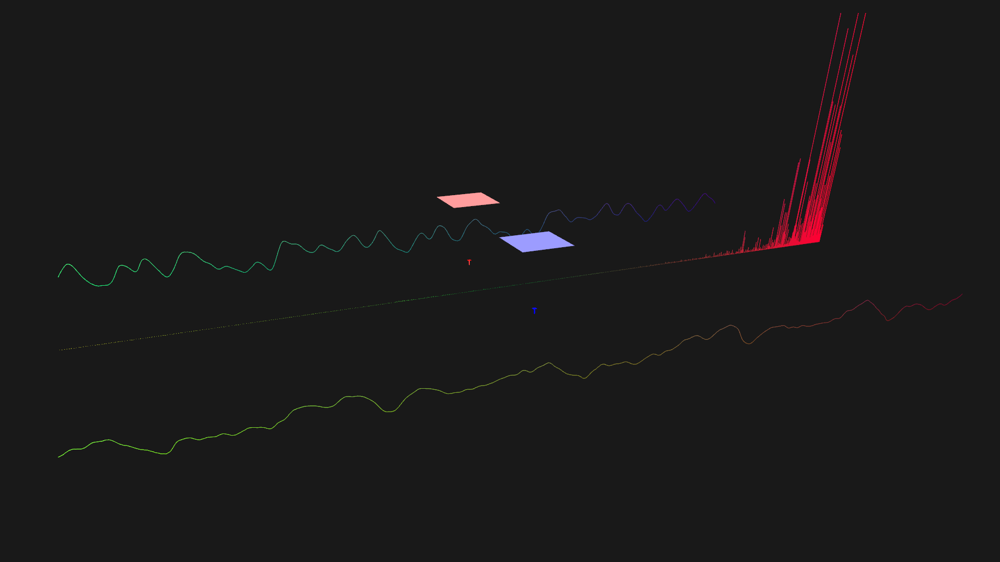
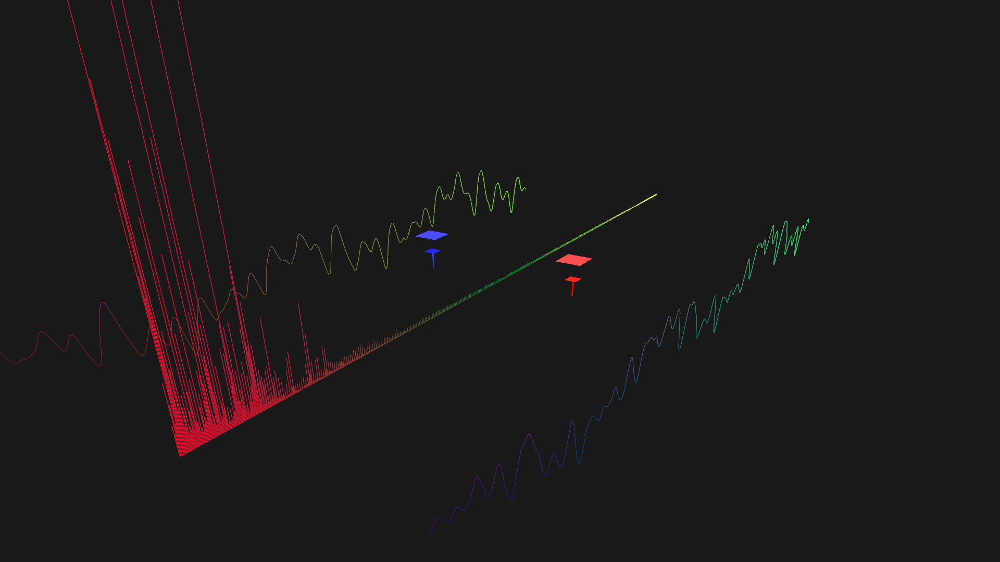
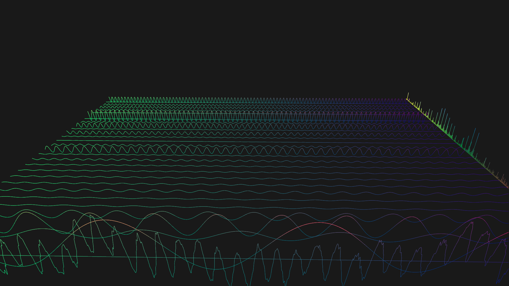
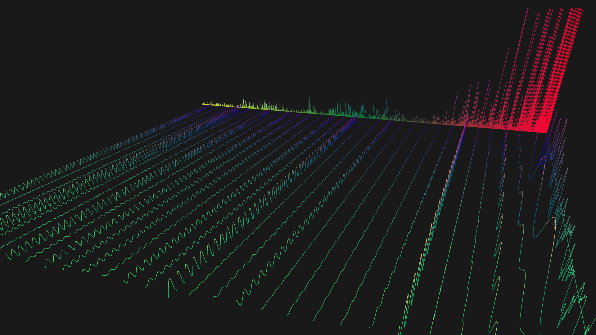
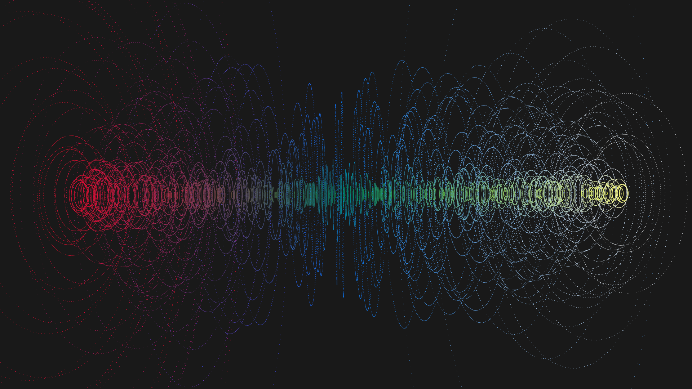
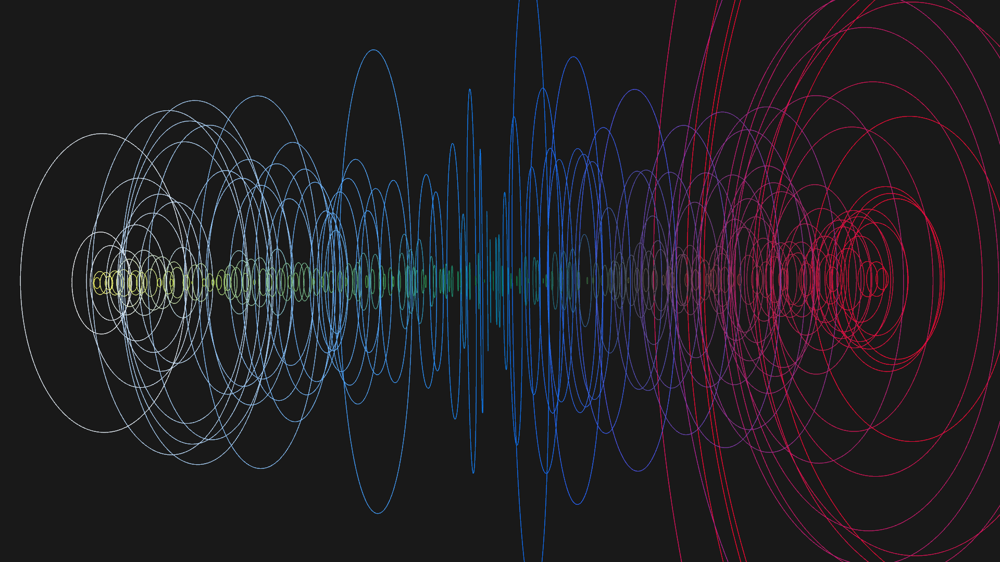
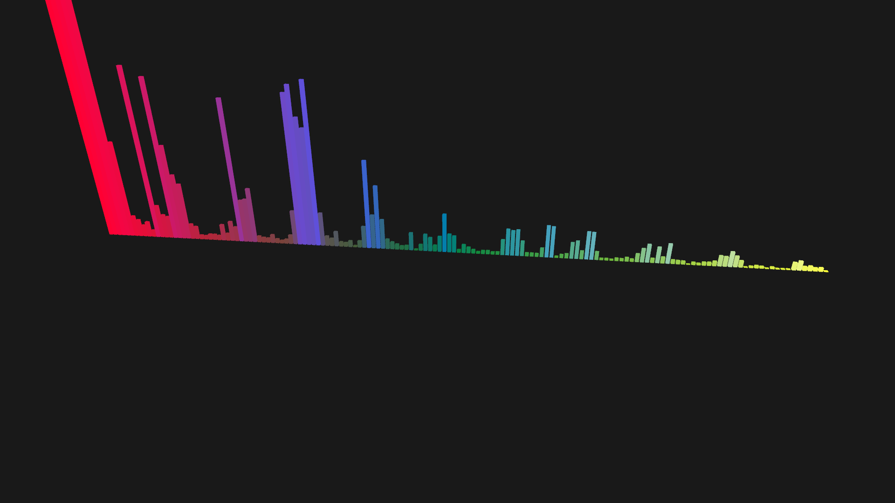
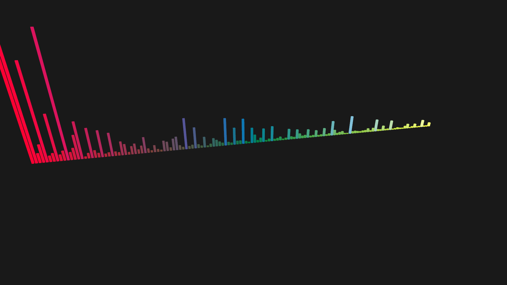

# Audio-Visualization---Waveform

An audio visualizer.

Repository: [Audio-Visualization---Waveform](https://github.com/chaosink/Audio-Visualization---Waveform)

`WAV(16 bits, 2 channels)` files supported only for now.

Visualized by `GLSL`.

Video on Youtube:
* [Audio-Visualization---Waveform, Spectrum, Level](https://youtu.be/7LfaSCFfXek)
* [Audio-Visualization---Waveform, Spectrum, Sine](http://youtu.be/M1vgzOlViHw)
* [Audio-Viusalization---Columned-Spectrum](https://youtu.be/Oxa4EXfW8GY)
* [Audio-Visualization---Dot-Circle-Spectrum](https://youtu.be/zAzh2CJGibc)

Video on Youku:
* [Audio-Visualization---Waveform, Spectrum, Level](http://v.youku.com/v_show/id_XMTI5MjcxMDQwMA==.html)
* [Audio-Visualization---Waveform, Spectrum, Sine](http://v.youku.com/v_show/id_XMTI5Mjc5MDg2NA==.html)
* [Audio-Viusalization---Columned-Spectrumm](http://v.youku.com/v_show/id_XMTI5Mjg0MDkxNg==.html)
* [Audio-Visualization---Dot-Circle-Spectrum](http://v.youku.com/v_show/id_XMTI5Mjg2Mjc2MA==.html)

# Compiling
```shell
make
```

# Usage
```shell
./waveform your_wav.wav
```

# Dependencies
[OpenGL - The Industry's Foundation for High Performance Graphics](https://www.opengl.org/)

[GLFW - An OpenGL library](http://www.glfw.org/)

[GLEW - The OpenGL Extension Wrangler Library](http://glew.sourceforge.net/)

[GLM - OpenGL Mathematics](http://glm.g-truc.net/0.9.6/index.html)

[ALSA - Advanced Linux Sound Architecture](http://www.alsa-project.org/main/index.php/Main_Page)

# Screenshots
Spectrum, waveform, level




Spectrum, waveform, sine




Spectrum-circle




Spectrum-column



