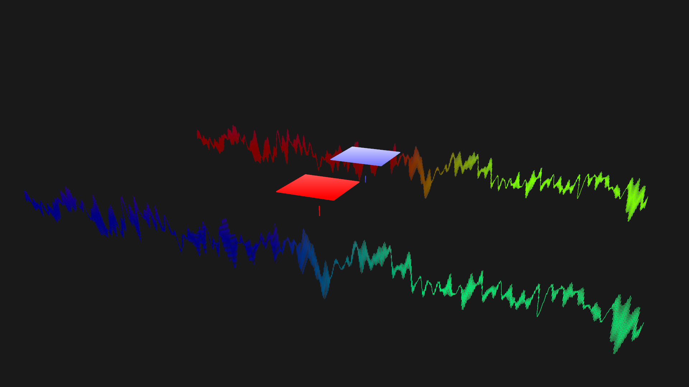
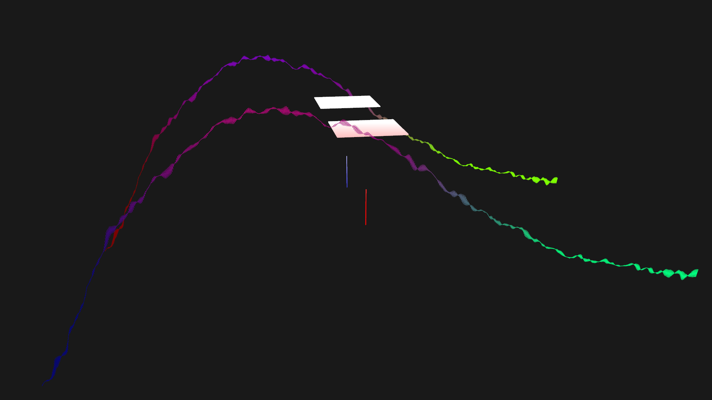
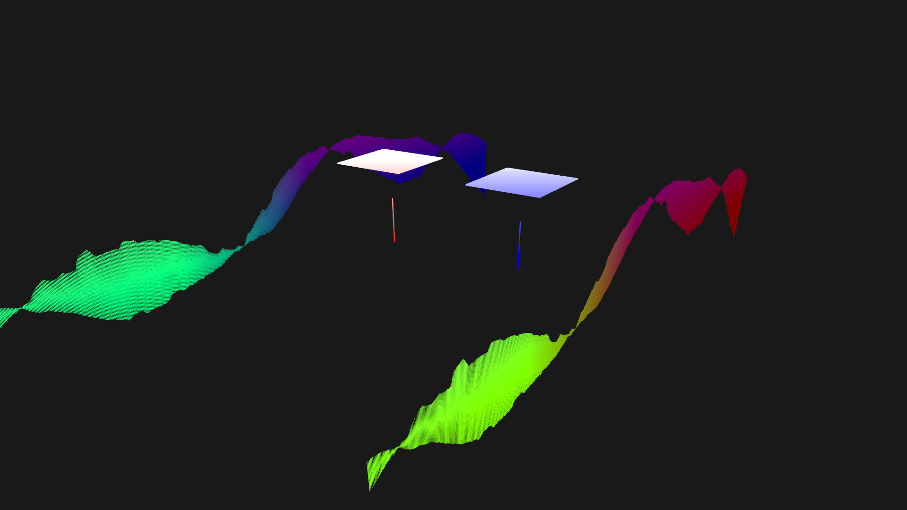
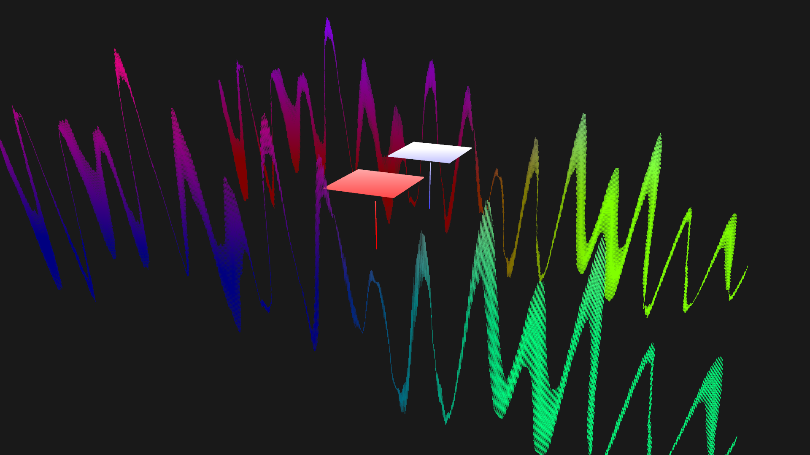

# Audio-Visualization---Waveform
An audio visualizer.

WAV(16 bits, 2 channels) files supported only for now.

Visualized by GLSL.

# Compiling
```shell
make
cd build
./waveform your_wav.wav
```

# Dependencies
[GLFW - An OpenGL library](http://www.glfw.org/)

[GLEW - The OpenGL Extension Wrangler Library](http://glew.sourceforge.net/)

[ALSA - Advanced Linux Sound Architecture](http://www.alsa-project.org/main/index.php/Main_Page)

# Screenshots







